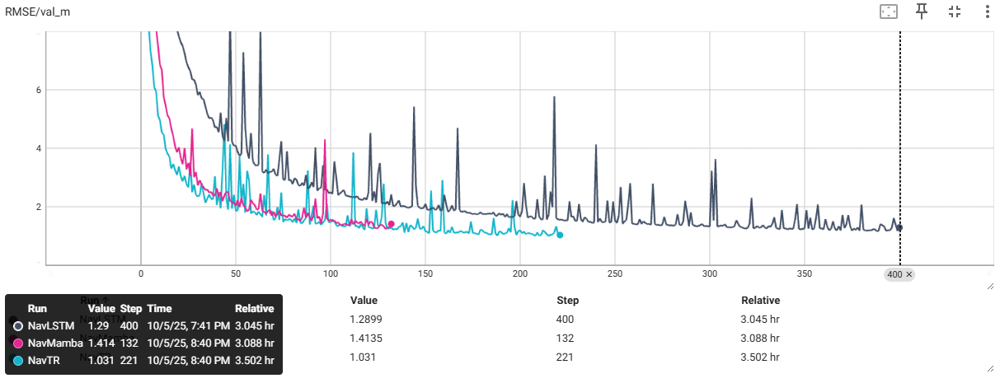

# NavMamba: Learning-Based GPS + INS Error Correction

This repository contains NavMamba, NavTR, NavLSTM: Learning-Based GPS + INS Error Correction. 

## Install
Create a conda virtaul environment and activate: 
```
conda create -n navmamba python=3.8 -y
conda activate navmamba
```
Install PyTorch and libraries:
```
pip install -r requirements.txt
```

## Prepare Datasets: KITTI Raw
Download KITTI Raw dataset: [link](https://www.cvlibs.net/datasets/kitti/raw_data.php) 

## Training and Evaluation

To train the model with KITTI:
```
python train_nav.py \
  --root /path/to/kitti_raw/ \
  --model NavMamba \
  --device cuda:0 \
  --save_dir ./out/NavMamba/
```

## Initial Result



## Catalog

- Full result description
- Evaluation on more datasets: nuScenes and Argoverse2 will be posted. 
